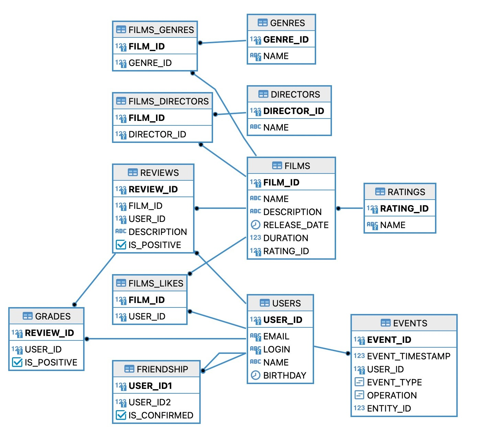

# Filmorate

### About Project
Filmorate is an educational group project for developers studying at [Yandex Practicum Java Developer](https://practicum.yandex.ru/java-developer/) course.
This repository contains a backend for the movie search REST API service.
_____
### About Team

**teamlead:**
+ [Andrei Sheryshov](https://github.com/a-sheryshov)

**developers:**
+ [Polina Shmargunova](https://github.com/PolinaShmargunova)
+ [Alexey Charushkin](https://github.com/Alexey-Charushkin)
+ [Ivan Rosokhach](https://github.com/IvanRosokhach)
+ [Anastasiya Salip](https://github.com/SalipA)

**code reviewer:**
+ [Sergey Mamonov](https://github.com/sergeymamonov), Yandex Practicum

**java mentor:**
+ [Egor Erokhin](https://github.com/egens), Yandex Practicum
_____
### About Stack
Technologies were used:
+ Java, version 11
+ Spring Boot
+ Maven
+ Git
+ Lombok
+ Logbook
+ H2 Database
+ Postman
_____

### About Functionality

+ **Core Functionality**

  main contributor: [Andrei Sheryshov](https://github.com/a-sheryshov)

  other contributors: [Polina Shmargunova](https://github.com/PolinaShmargunova) *(delete by id for Films and Users)*; [Anastasiya Salip](https://github.com/SalipA)*(core for Reviews)* 

  supports: Users, Films, Genres, Ratings, Reviews, Directors
   + create
   + update
   + get all
   + get by id
   + delete by id
+ **Additional  Functionality**
  + **Friendship functionality**
  
    main contributor: [Andrei Sheryshov](https://github.com/a-sheryshov)
  
    supports: Users
    + add friends
    + delete friends
    + get list of friends
    + get list of common friends with another user

  + **Like functionality**
  
    main contributor: [Andrei Sheryshov](https://github.com/a-sheryshov)
  
    supports: Films
    + add like
    + delete like
    + get list of popular(most liked) films

  + **Review and Grade functionality**
  
    main contributor: [Anastasiya Salip](https://github.com/SalipA)
  
    supports: Reviews
    + get list of reviews by film id sorted by users grades
    + add grade (like or dislike)
    + delete grade (like or dislike)
  
  + **Search functionality**
    
    main contributor: [Polina Shmargunova](https://github.com/PolinaShmargunova)
  
    supports: Films
    + get list of popular(most liked) films based on search query. The algorithm is able to search by substring in the title of the film or the name of the director.
    
  + **Common films functionality**
  
    main contributor: [Alexey Charushkin](https://github.com/Alexey-Charushkin)
    
    supports: Films
    + get list of common popular(most liked) films for friends
  
  + **Recommendations functionality**
  
    main contributor: [Alexey Charushkin](https://github.com/Alexey-Charushkin)

    supports: Users
    + get list of films based on similar users choices. [More information about the algorithm.](https://www.baeldung.com/java-collaborative-filtering-recommendations)
    
  + **Feed functionality**
  
    main contributor: [Ivan Rosokhach](https://github.com/IvanRosokhach)
  
    supports: Users
    + get list of users event by user id
    
  + **Other specific functionality**
  
    main contributor: [Ivan Rosokhach](https://github.com/IvanRosokhach)
  
    supports: Films
      
      + get list of popular(most liked) films *filtered by genre and year of release*
    
    main contributor: [Andrei Sheryshov](https://github.com/a-sheryshov)

    supports: Films
  
      + get list of films *filtered by director* and sorted by popular(most liked) or year of release

  

____

### About Endpoints and GSON-Objects

Learn more information about [endpoints](api.md) and provided JSON - objects in project documentation.

___
### About Entity-Relationship model

Author of the project database architecture: [Andrei Sheryshov](https://github.com/a-sheryshov)

